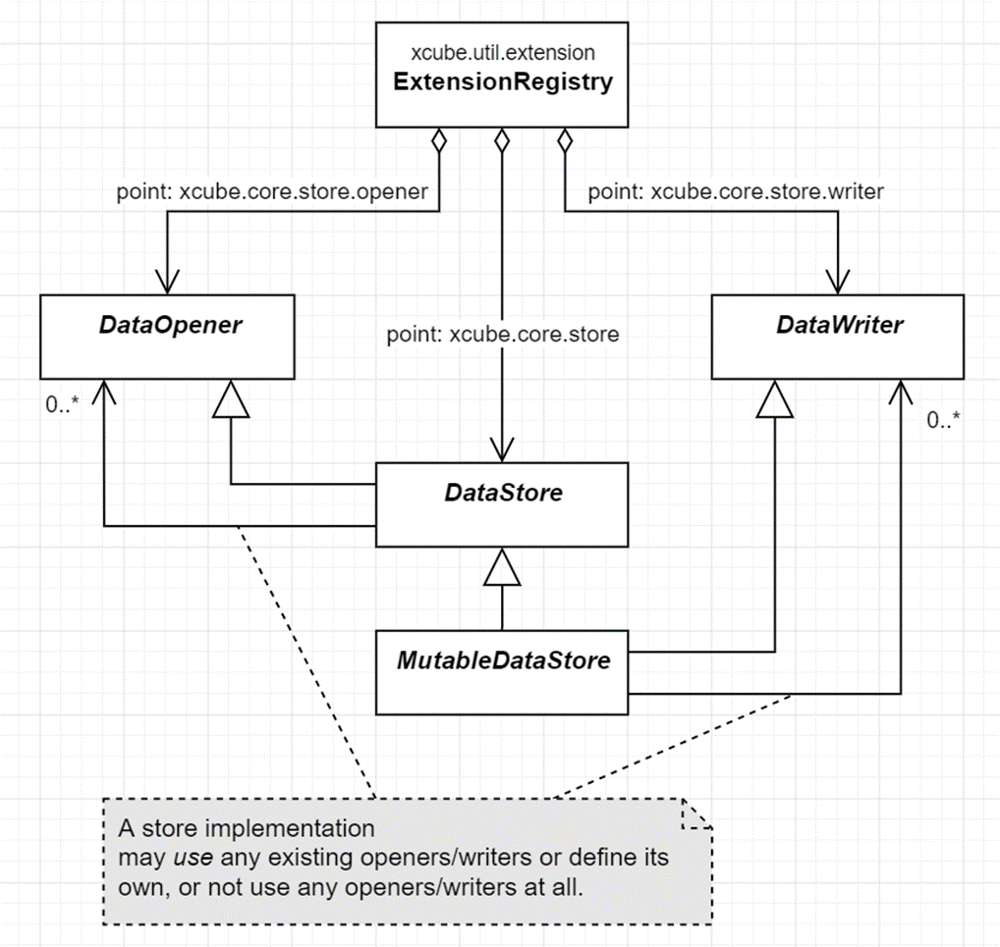

[xcube Dataset Convention]: ./cubespec.md
[xarray.Dataset]: https://docs.xarray.dev/en/stable/generated/xarray.Dataset.html
[ESA Climate Data Centre]: https://climate.esa.int/en/odp/
[Sentinel Hub]: https://www.sentinel-hub.com/
[xcube.core.store]: https://github.com/dcs4cop/xcube/tree/master/xcube/core/store
[Dask arrays]: https://docs.dask.org/en/stable/array.html
[multi-resolution dataset]: ./mldatasets.md
[geopandas.GeoDataFrame]: https://geopandas.org/en/stable/docs/reference/api/geopandas.GeoDataFrame.html
[JSON Object Schema]: https://json-schema.org/understanding-json-schema/reference/object.html
[DataStore]: https://xcube.readthedocs.io/en/forman-xxx-datastore_docu/api.html#xcube.core.store.DataStore
[MutableDataStore]: https://xcube.readthedocs.io/en/forman-xxx-datastore_docu/api.html#xcube.core.store.MutableDataStore


# Data access

In xcube, data cubes are raster datasets that are basically a collection 
of N-dimensional geo-physical variables represented by
[xarray.Dataset] Python objects (see also [xcube Dataset Convention]). 
Data cubes may be provided by a variety of sources and may be stored using 
different data formats. In the simplest case you have a NetCDF file or a 
Zarr directory in your local filesystem that already represents a data cube. 
Data cubes may also be stored on AWS S3 or Google Cloud Storage using the 
Zarr format. Sometimes a set of NetCDF or GeoTIFF files in some storage 
must first be concatenated to form a data cube. In other cases, data cubes 
can be generated on-the-fly by suitable requests to some cloud-hosted data 
API such as the [ESA Climate Data Centre] or [Sentinel Hub].

## Data store framework

The _xcube data store framework_ provides a simple and consistent Python 
interface that is used to open [xarray.Dataset] and other data objects from
_data stores_ which abstract away the individual data sources, protocols, 
formats and hides involved data processing steps. For example, the following 
two lines open a data cube from the [ESA Climate Data Centre] comprising the 
essential climate variable Sea Surface Temperature (SST):

```python
store = new_data_store("cciodp")
cube = store.open_data("esacci.SST.day.L4.SSTdepth.multi-sensor.multi-platform.OSTIA.1-1.r1")
```

Often, and in the example above, data stores create data cube _views_ on
a given data source. That is, the actual data arrays are subdivided into 
chunks and each chunk is fetched from the source in a "lazy" manner.
In such cases, the [xarray.Dataset]'s variables are backed by [Dask arrays].
This allows data cubes to be virtually of any size.

Data stores can also be writable. All read-only data stores share the same 
functional interface share the same functional interface and so do writable
data stores. Of course, different data stores will have different
configuration parameters. Also, the parameters passed to the `open_data()`
method, or respectively the `write_data()` method, may change based on the 
store's capabilities. 
Depending on what is offered by a given data store, also the parameters 
passed to the `open_data()` method may change. 

Data stores can provide the data using different Python in-memory 
representations or data types.
The most common representation for a data cube is an [xarray.Dataset]
instance, multi-resolution data cubes would be represented as a 
[multi-resolution dataset] instance. Vector data is usually provided as 
an instance of [geopandas.GeoDataFrame].

The xcube data store framework is exported from the [xcube.core.store] 
package, see also its [public API reference]().

The [DataStore] abstract base class is the primary user interface for 
accessing data in xcube. The most important operations of a data store are:

* `list_data_ids()` - enumerate the datasets of a data store;
* `search_data(...)` - search for datasets in the data store;
* `describe_data(id)` - describe a given dataset in terms of its metadata;
* `open_data(id, ...)` - open a given dataset.

The [MutableDataStore] abstract base class represents a writable data 
store and extends [DataStore] by the following operations:

* `write_data(dataset, id, ...)` - write a dataset to the data store;
* `delete_data(id)` - delete a dataset from the data store;

Above, the ellipses `...` are used to indicate store-specific parameters
that are passed as keyword-arguments. For a given data store instance, 
it is not obvious what are parameters are allowed. Therefore, data stores 
provide a programmatic way to describe the allowed parameters for the  
operations of a given data store by the means of a parameter schema:

* `get_open_data_params_schema()` - describes parameters of `open_data()`;
* `get_search_data_params_schema()` - describes parameters of `search_data()`;
* `get_write_data_params_schema()` - describes parameters of `write_data()`.

All operations return an instance of a [JSON Object Schema].
The JSON object's properties describe the set of allowed and required 
parameters as well as the type and value range of each parameter. The 
schemas are also used internally to validate the parameters passed by the 
user.

xcube comes with a predefined set of writable, filesystem-based data stores,
Since data stores are xcube extensions, additional data stores can be added 
by xcube plugins. The data store framework provides a number of global 
functions that can be used to access the available data stores: 

* `find_data_store_extensions() -> List[Extension]` - get a list of 
  xcube data store extensions;
* `new_data_store(store_id, ...) -> DataStore` - instantiate a data store with 
  store-specific parameters;
* `get_data_store_params_schema(store_id) -> Schema` - describe the store-specific 
  parameters that must/can be passed to `new_data_store()` 
  as [JSON Object Schema].

For example:

```python
from xcube.core.store import get_data_store_params_schema
from xcube.core.store import new_data_store

store_schema = get_data_store_params_schema("sentinelhub")
store = new_data_store("sentinelhub",
                       # The following parameters are specific to the 
                       # "sentinelhub" data store. 
                       # Refer to the store_schema.
                       client_id="YOURID",
                       client_secret="YOURSECRET",
                       num_retries=250,
                       enable_warnings=True)

open_schema = store.get_open_data_params_schema("S2L2A")
cube = store.open_data("S2L2A",
                       # The following parameters are specific to 
                       # "sentinelhub" datasets, such as "S2L2A". 
                       # Refer to the open_schema.
                       variable_names=["B03", "B06", "B8A"],             
                       bbox=[9, 53, 20, 62],             
                       spatial_res=0.025,             
                       crs="WGS-84",              
                       time_range=["2022-01-01", "2022-01-05"],             
                       time_period="1D")
```

## Data store implementations

### Filesystem-based data stores

They are named `"file"` (for the local filesystem), `"s3"` for AWS S3 
compatible object storage systems, and `"memory"` mimicking an in-memory 
filesystem. (See also dedicated section below). 


## Developing a new data store

